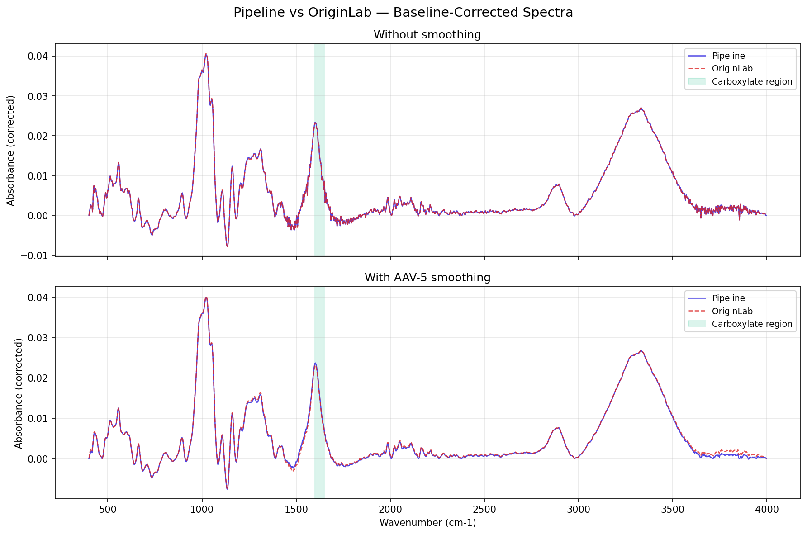

# Pipeline vs OriginLab — Validation Report

**Date:** 2026-05-05 16:40
**Spectrum:** `Amostra TCNF Paul n.1.1.dpt`
**Anchor points:** 19 (manual, identical for both)
**Carboxylate range:** 1600–1650 cm-1

## Results

| Configuration | Metric | Pipeline | Origin | Diff % |
|---|---|---|---|---|
| Sin smoothing | Altura | 0.02335 | 0.02326 | 0.41% |
| Sin smoothing | Área | 0.75335 | 0.75076 | 0.34% |
| Con smoothing AAV-5 | Altura | 0.02368 | 0.02313 | 2.39% |
| Con smoothing AAV-5 | Área | 0.77014 | 0.75136 | 2.50% |

## Comparison Plot

## Conclusion

Peak height deviation: 0.41% (no smooth), 2.39% (with smooth).
Integrated area deviation: 0.34% (no smooth), 2.50% (with smooth).

Pipeline uses scipy `make_interp_spline` (k=3) for baseline interpolation. OriginLab uses its proprietary Peak Analyzer. Small deviations are expected due to differences in spline implementation details.